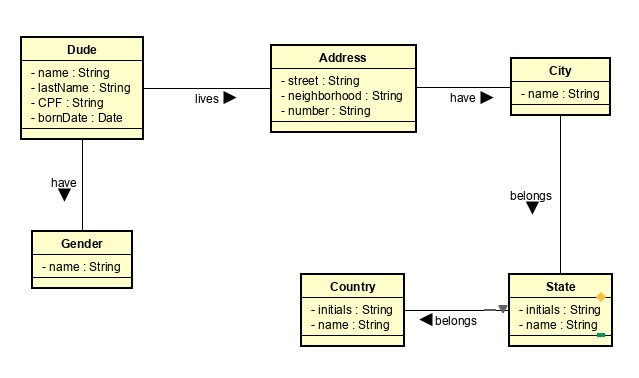
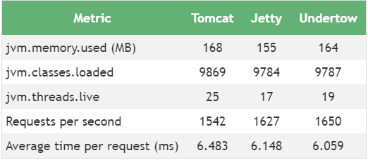

# ws-dude

[](https://travis-ci.org/yanBrandao/ws-dude)
[](https://coveralls.io/github/yanBrandao/ws-dude?branch=master)
## Description

I'ts a backend to crud dudes!

## Objective

ws-dude is a way to store a person data and define where he lives and his gender. It's represented by class diagram in the image below.



## Development

Ws-dude was made in Spring-Boot Web application, that give to developer a complete API framework to easily develop solutions and with this it's possible to make a great quality application. For this, in ws-dude was used [JUnit](https://junit.org/junit4/) for create automated test and to visualize all this test, was used [JaCoCo](https://www.eclemma.org/jacoco/) to know how much test coverage is appling on the code. Besides that, it was used [TravisCI](https://travis-ci.org/) to build and send Coverage Results to [Coveralls](https://coveralls.io/) for project badges. Thinking in performance, the server to run ws-dude application was [Undertow](http://undertow.io/) because in comparasion with other servlet container it gets the most request per seconds and the lowest average time per request like the image below.




In ws-dude, the information is stored in a [Postgres](https://www.postgresql.org/) database. 

## Instructions to Run

### Requirements

- To run database will needed ***docker*** installed.

- To run spring-boot application is necessary have installed Java8 and maven to run the application. If use some IDE is necessary to install [Lombok](https://projectlombok.org/)

### Running database

It's recommended to use POSTGRES_PASSWORD like showed below, because this application is pre-defined with this password. But if needed, it's possible change variable when run the application.

```shell
$ docker run --name some-postgres -e POSTGRES_PASSWORD=postgresPassword -d postgres
```

### Running de application

With Java8 configured in IDE, or in PATH it's just need to do the command below:

```shell
$ mvn clean spring-boot:run -DDB.USERNAME=postgres -DDB.DATABASE=postgres -DDB.PASSWORD=postgresPassword -DDB.HOST=localhost
```

To run tests and see the JaCoCo report do:

```shell
mvn clean test jacoco:report
```

and open file in JaCoCo report path: "./server/target/site/jacoco/index.html"


### Testing endpoints

It's given a PostmanCollection in this folder, if want to test the api request, import **WsDudeCollection.postman_collection.json**.
